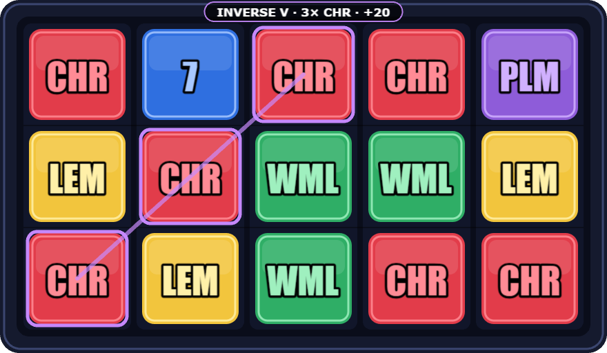

# ECS Slots — 5×3 slot machine

A simplified slot machine built on an **ECS** architecture with **PixiJS v8**
(WebGL, Canvas fallback) and TypeScript. Runs on desktop and mobile.



## Run

```bash
npm install
npm run dev        # http://localhost:5173
npm run build      # typecheck + production bundle into dist/
npm run preview    # serve the production bundle
```

No assets to download — every symbol is drawn procedurally at boot and baked
into a texture, so the repo is self-contained.

## Controls

| Action | Desktop | Mobile |
| --- | --- | --- |
| Spin | `SPIN` button, `Space`, `Enter` | `SPIN` |
| Skip the current event | click the board, or `SPIN` (`SKIP`) | tap the board |
| Turbo on/off | `Turbo` | `Turbo` |
| Autoplay | pick a count, press `Auto` | same |
| Stop autoplay | `Auto` or `STOP` | same |

---

## Requirements checklist

### Board
- **5 reels × 3 visible rows.**
- **7 symbols** — Cherry, Lemon, Orange, Plum, Watermelon, Seven, BAR.
- Each symbol has its own **value (multiplier)** and **frequency (weight)** —
  [`src/game/config/symbols.ts`](src/game/config/symbols.ts).

### Gameplay
- Name is asked **once per session** (kept in `sessionStorage`, so a refresh
  resumes instead of re-asking).
- Starting balance **1000**, fixed bet **10** per spin.
- `SPIN` starts all reels; they **stop left to right with a delay**
  (`firstStopDelay + reelIndex * reelStopStep`).
- Winning combinations are evaluated once every reel has stopped.
- Running out of credits is a real state, not a dead button: autoplay cancels
  itself, `SPIN` disables, and an **out-of-credits prompt** offers a fresh
  bankroll (the player name is kept — it is a new bankroll, not a new session).

### Paylines — 5 active
| # | Name | Rows (per reel) |
| --- | --- | --- |
| 1 | Top | 0-0-0-0-0 |
| 2 | Middle | 1-1-1-1-1 |
| 3 | Bottom | 2-2-2-2-2 |
| 4 | V | 0-1-2-1-0 |
| 5 | Inverse V | 2-1-0-1-2 |

### Paytable
Wins pay **left to right**, from reel 1, for **3 or more** identical symbols:

```
win = BET × lineCoefficient(count) × symbolMultiplier
```

| Count | Coefficient | | Symbol | Multiplier |
| --- | --- | --- | --- | --- |
| 3 | ×2 | | Cherry, Lemon, Orange | ×1 |
| 4 | ×5 | | Plum, Watermelon | ×2 |
| 5 | ×10 | | Seven | ×5 |
| | | | BAR | ×10 |

Example: 4 × Plum on the middle line → `10 × 5 × 2 = 100`.

### Bonus features — all three implemented
1. **Tall symbol** — BAR is 2 cells high. It occupies two strip slots, is drawn
   by one double-height sprite, counts on every payline crossing either cell, and
   can never be sliced in half at the window edge (reels only stop on positions
   precomputed to keep it whole).
2. **Autoplay + turbo** — 10 / 25 / 50 / ∞ automatic spins; turbo speeds up reel
   rotation and win presentation and can be toggled **at any moment, including
   mid-spin**, because timings are re-read from config every frame rather than
   captured when the spin starts.
3. **Event skip** — clicking or tapping the board fast-forwards whatever is
   playing: spinning reels snap to their result, the payline cycle collapses to
   "all lines at once", a second skip ends the presentation. The outcome is
   rolled before the animation begins, so skipping can never change the result.

### Platforms
The board is authored at a fixed design size and letterboxed into the available
space by a `ResizeObserver`, so desktop, tablet and phone (portrait and
landscape) share one layout. The HUD is DOM, sized in viewport units, with a
compact variant under 460px of height.

---

## Architecture

Full write-up with diagrams: **[docs/ARCHITECTURE.md](docs/ARCHITECTURE.md)**.

Short version — five systems run in a fixed order each frame, communicating only
through component data:

```
DOM input ──▶ intent flags on GameFlow / Settings
                    │
   world.update(dt) ▼
   1 SpinFlowSystem        phase machine, economy, outcome roll, skip, turbo
   2 ReelSpinSystem        reel motion  (Reel.position)
   3 ReelRenderSystem      position → recycled sprite pool
   4 WinPresentationSystem paylines + cell highlights
   5 HudSystem             meters, buttons, persistence
```

`src/ecs/index.ts` is a small, dependency-free implementation of the pattern from
the article in the brief (bitmask matching, live query sets, singleton
components). The reference `@releaseband/ecs` package is published to a private
GitHub Packages registry and is not installable without an org token, so the same
API shape is reproduced locally.

Everything tunable — weights, multipliers, paylines, payouts, geometry, timings —
lives in `src/game/config/` and nowhere else.

---

## Math

Measured over 20 000 simulated spins with the weights in
`config/symbols.ts` and 48-cell strips:

| Metric | Value |
| --- | --- |
| RTP | ≈ 49.7 % |
| Hit rate | ≈ 13.7 % |

Reproduce it from the dev console (`npm run dev` exposes `__slots`):

```js
const { rng, strips } = __slots.world.singleton(
  (await import('/src/game/components.ts')).Config);
const { evaluate } = await import('/src/game/services/evaluator.ts');
const { readGrid } = await import('/src/game/services/strips.ts');

let bet = 0, won = 0;
for (let i = 0; i < 20000; i++) {
  const stops = strips.map(s => s.stopPositions[rng.int(s.stopPositions.length)]);
  won += evaluate(readGrid(strips, stops), 10).total;
  bet += 10;
}
console.log((100 * won / bet).toFixed(1) + '%');
```

RTP is a direct consequence of the paytable fixed by the brief plus the symbol
weights; tuning it is a one-file change (`weight` values in `config/symbols.ts`).

The RNG is a seeded `mulberry32` behind an interface, so a session can be
replayed exactly from its seed — useful for reproducing a "that spin looked
wrong" report.
