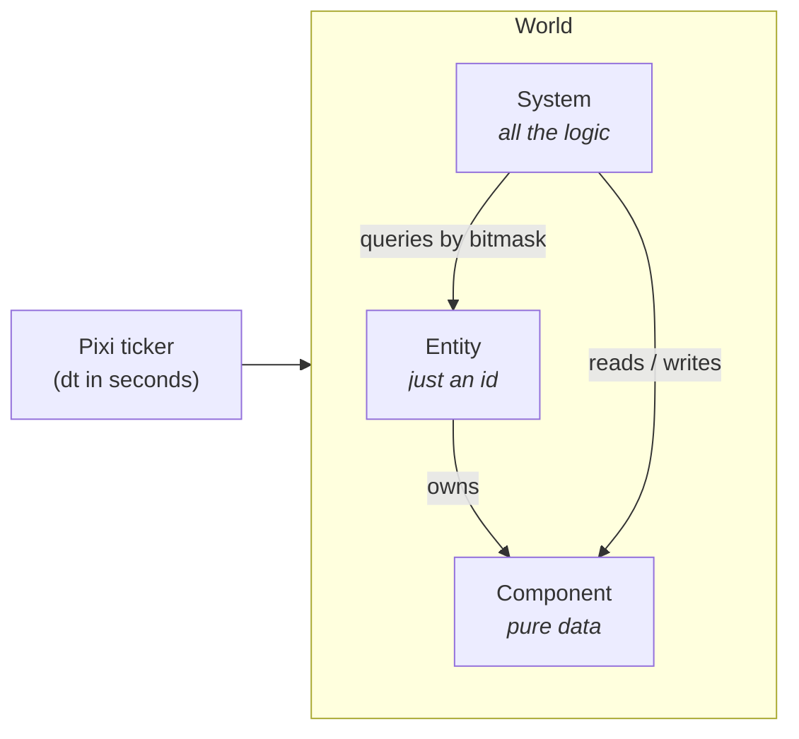
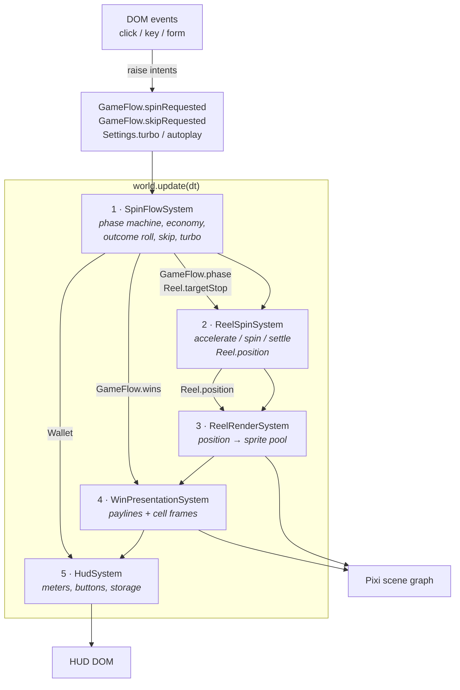
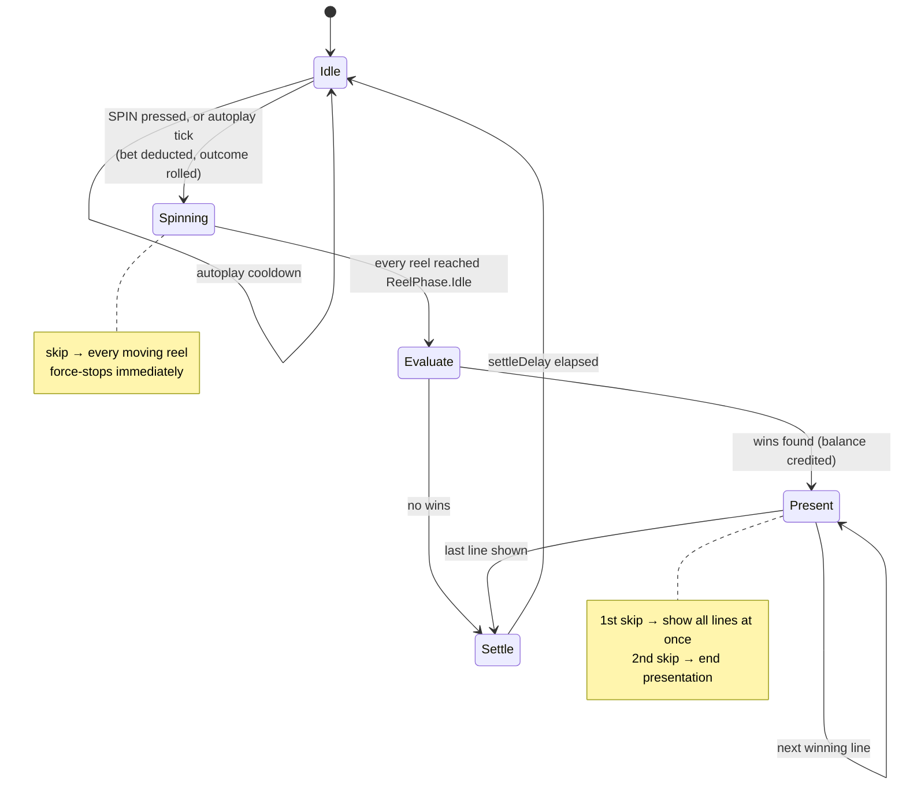

# Architecture

## 1. The ECS in one picture



`src/ecs/index.ts` is a small, dependency-free implementation of the pattern
described in the article linked in the brief. Every component class gets a bit
index, every entity keeps a 32-bit mask of the components it owns, and every
`Query` keeps a live `Set` of matching entities that is refreshed only when an
entity's mask changes. Systems therefore iterate a ready-made set instead of
scanning the world each frame.

The reference library `@releaseband/ecs` is published to a private GitHub
Packages registry and cannot be installed without an org token, so the same API
shape (`World`, `Query`, `System`, singleton components) is reproduced locally.

## 2. Entities in this game

| Entity | Components | Count |
| --- | --- | --- |
| Singleton | `Session`, `Wallet`, `GameFlow`, `Settings`, `Config`, `Stage` | 1 |
| Reel | `Reel`, `ReelView` | 5 |

Singletons live on one shared entity so systems can reach global state through
the world (`world.singleton(GameFlow)`) instead of a module-level variable.

## 3. Systems and data flow

Systems run in a fixed order once per frame. Each one owns exactly one concern,
and the only channel between them is component data.



Note the direction of the arrows into the frame: input never mutates the game
directly. A click only raises an intent flag, and `SpinFlowSystem` decides on the
next tick what that intent means in the current phase. That is what keeps "click
to skip" correct no matter what is on screen when the click lands.

## 4. Spin state machine

Owned entirely by `SpinFlowSystem`.



The outcome is rolled **up front**, when the spin starts: each reel picks its
`targetStop` from the strip and the animation merely plays back an already-known
result. This mirrors how a real server-driven slot works and means a skip can
never change what the player wins.

## 5. Reel model

A reel strip is a **circular array of 1-cell slots**. `Reel.position` is a float
offset in cells; its integer part indexes the strip.

```
  index direction: HIGHER index = HIGHER on screen

     ...                       slot k = -2   (buffer, masked)
  strip[p+1]                   slot k = -1   (buffer, masked)
  strip[p]     ── top row ──   slot k =  0   ┐
  strip[p-1]   ── mid row ──   slot k =  1   ├ visible window
  strip[p-2]   ── bot row ──   slot k =  2   ┘
  strip[p-3]                   slot k =  3   (buffer, masked)
     ...                       slot k =  4   (buffer, masked)
```

`ReelRenderSystem` places the sprite of slot `k` at

```
strip index = floor(position) - k
y           = (k + frac(position)) * CELL_HEIGHT
```

so a rising `position` scrolls symbols downwards. Seven sprites per reel are
recycled — three visible rows plus two buffer rows on each side, which is what
lets a two-cell symbol enter and leave the window without popping.

Reel phases (`ReelSpinSystem`):

| Phase | Behaviour |
| --- | --- |
| `Accelerating` | `speed` eases in over `accelDuration` |
| `Spinning` | constant `spinSpeed`; stops when `elapsed >= firstStopDelay + index * reelStopStep` — the left-to-right cascade |
| `Stopping` | tween to the nearest future position matching `targetStop`, using `easeOutBack` so the drum overshoots a fraction of a cell and springs back |
| `Idle` | parked exactly on `targetStop` |

Timings are read from `Config.timing` **every frame**, never captured at spin
start. That single decision is what makes the turbo toggle apply to a spin that
is already running.

## 6. Tall symbol (bonus #1)

BAR is two cells high. It occupies two consecutive strip slots — the `bottom`
half is emitted first so the `top` half lands at the higher index, i.e. above it
on screen.

```
strip:  ... | single | bottom | top | single | ...
                        └─ one BAR, drawn by a single 2-cell-tall sprite
                           attached to the `top` slot; the `bottom` slot's
                           sprite is simply hidden.
```

Two consequences fall out for free:

- **Evaluation needs no special case.** `readGrid` writes the BAR id into both
  cells the symbol covers, so it matches on every payline crossing either of
  them.
- **It is never sliced in half.** `buildStrip` precomputes `stopPositions`,
  excluding any position that would leave a `bottom` on the top row or a `top`
  on the bottom row. Reels only ever stop on positions from that list.

## 7. Turbo, autoplay and skip (bonuses #2, #3)

| Feature | Where | How |
| --- | --- | --- |
| Turbo | `Settings.turbo` → `Config.timing` | `SpinFlowSystem` re-resolves the timing profile every frame, so toggling mid-spin retimes the reels that have not stopped yet |
| Autoplay | `Settings.autoplayRemaining` / `autoplayInfinite` | `Idle` starts the next spin once the autoplay cooldown expires; stops automatically when the balance can no longer cover the bet |
| Skip | `GameFlow.skipRequested` | consumed by whichever phase is active: force-stop the reels while spinning, collapse the payline cycle while presenting, cut the settle delay short |
| Restart | `GameFlow.restartRequested` | consumed by `Idle` only, so a bankroll can never be reset mid-spin; `HudSystem` shows the prompt exactly when `idle && balance < bet` |

## 8. Where things live

```
src/
  ecs/index.ts                 World, Query, System, component registry
  main.ts                      bootstrap: Pixi app, singletons, systems, resize
  game/
    components.ts              every component (pure data)
    config/                    symbols, paylines, paytable, geometry, timings
    services/                  rng, strip building, evaluator, easing, storage
    systems/                   SpinFlow, ReelSpin, ReelRender, WinPresentation, Hud
    view/                      procedural symbol textures, board construction
    ui/dom.ts                  DOM refs + paytable rendering
```

Anything a designer would want to tune — weights, multipliers, paylines,
payouts, timings — is in `game/config/` and nowhere else.
